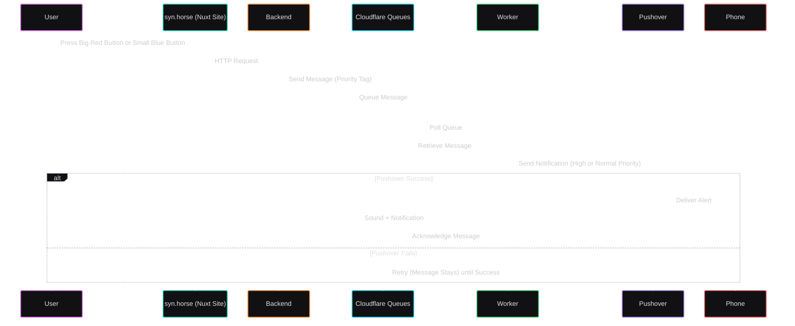

# The Big Red Button

(and the Small Blue Button)

## The what?

Now that the repo and CI are all set up on the Affirm repository, and we have a boilerplate Nuxt app to work with, my role transitions away from backend lead and yields to Selene to run the show.

That's not to say I'm going to be uninvolved going forward. There's going to be weirdness and brokenness and just plain wacky behaviour, and I'm the person to call when something isn't behaving correctly (or you want it to behave another way).

Which is to say: **my job is to make sure that you're supported in your development efforts**.

## The how?

Now, we operate on different timezones.

My cunning plan for this situation is to offer an easy way to page me. This will have two components:

- A **Big Red Button** for urgent issues and emergencies.
  - This will yell at me regardless of the time of day.
  - It won't shut up until I acknowledge it.
  - Press this if you need to, that's why it's there.
  - Understand it's designed to get my immediate attention at all costs.
- A small blue button for things which need fixing but not this instant.
  - These can wait until I'm awake.
  - I'll still get an alert until I acknowledge it...
  - ...but it won't be as loud and obnoxious as the Big Red Button.
  - It won't wake me up, but it'll get my attention when I'm awake.
  - Press this freely.

## The tech?

The buttons live on my personal site, [syn.horse][syn-horse], which is another Nuxt site.

Comms are handled using [Cloudflare Queues][cf-queues] and [Pushover][pushover].

A user can hit either button, which will trigger a request to the backend. The backend will then send a message to the appropriate queue, which will be picked up by a worker. The worker will then send a notification to my phone using Pushover.

Using the queues means that the system is more resilient to failures. As long as the message makes it into the queue, it will stay there until processed.

When processed, the worker will attempt to send the notification to Pushover. If it fails, it will not consume the message from the queue, and it will inherently be retried until it succeeds.

Red Button messages are tagged high-priority on Pushover. This means they'll make a louder noise, override any silencing, and generally be total shitbags until they're acknowledged.

Blue Button messages are tagged as normal priority; they'll make a different noise, won't override silencing, and will be more polite about getting my attention.

## The when?

I'm working on it. ETA is "when it's done". Until then, Signal is the place to get in touch with me urgently.

[syn-horse]: https://syn.horse
[pushover]: https://pushover.net/api
[cf-queues]: https://developers.cloudflare.com/queues/
